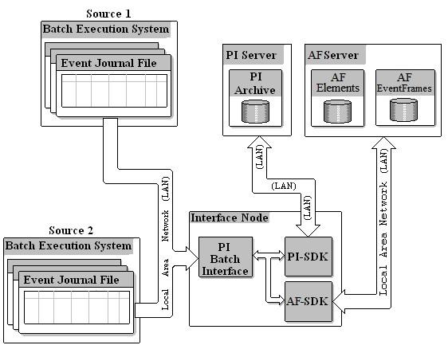
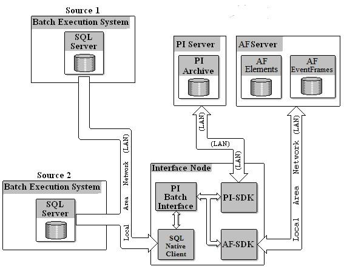
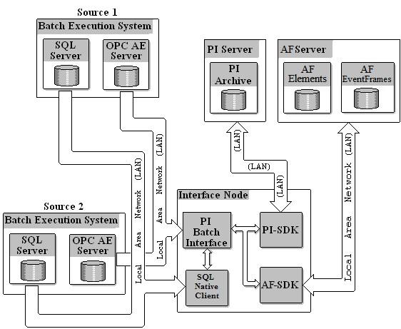

# Batch interface configuration

<!-- Interface-specific framework topic. Customize this topic for your interface. Remove the diagrams that don't apply -->

The following diagrams illustrate various options for configuring batch interfaces, depending on the data source and the desired PI System output.

Data source: event files. Target: PI AF (event frames and assets)

Data source: SQL Server. Target: PI AF (event frames and assets)

Data source: SQL Server + alarms and events server. Target: PI AF (event frames and assets)
